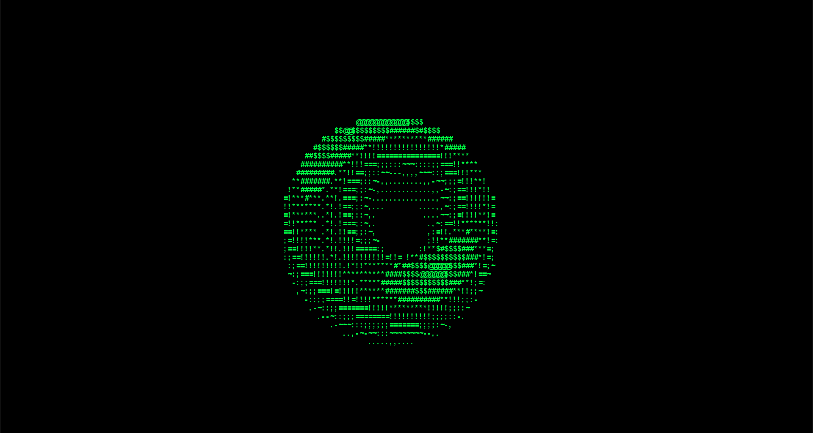

# Donut.C in .py with RGB 🍩

## Introduction

Python implemention of the popular "Donut.C" program in 2006. The donut behaves like the donut in C, however, now has RGB colouring. 

## Math Behind the Donut

The intricate mathematics driving the donut animation involves trigonometry and parametric equations. Key parameters, including theta (θ), phi (φ), and various trigonometric functions, govern the positions of characters on the screen. The donut rotates by incrementing the values of A and B over time.
### 1. Parametric Equations for a Torus

The parametric equations for a torus (donut) in 3D space define its coordinates based on the angles of rotation (\( \theta \) and \( \phi \)) and the major and minor radii (\( R \) and \( r \)):

$$\[ x(\theta, \phi) = (R + r \cos(\theta)) \cos(\phi) \]$$
$$\[ y(\theta, \phi) = (R + r \cos(\theta)) \sin(\phi) \]$$
$$\[ z(\theta, \phi) = r \sin(\theta) \]$$

### 2. Rotation Matrix

To simulate the rotation of the torus, rotation matrices are employed. These matrices allow for rotation about the x-axis $(\( R_x(\alpha) \))$, y-axis $(\( R_y(\beta) \))$, and z-axis $(\( R_z(\gamma) \))$:

$$\[ R_x(\alpha) = \begin{bmatrix} 1 & 0 & 0 \\ 0 & \cos(\alpha) & -\sin(\alpha) \\ 0 & \sin(\alpha) & \cos(\alpha) \end{bmatrix} \]$$

$$\[ R_y(\beta) = \begin{bmatrix} \cos(\beta) & 0 & \sin(\beta) \\ 0 & 1 & 0 \\ -\sin(\beta) & 0 & \cos(\beta) \end{bmatrix} \]$$

$$\[ R_z(\gamma) = \begin{bmatrix} \cos(\gamma) & -\sin(\gamma) & 0 \\ \sin(\gamma) & \cos(\gamma) & 0 \\ 0 & 0 & 1 \end{bmatrix} \]$$

### 3. Coordinate Transformation

The original torus coordinates are transformed using the rotation matrices to obtain the rotated coordinates. The transformed coordinates are then projected onto the 2D screen using perspective projection:

$$\[ x_{\text{new}} = x \cdot \cos(A) - y \cdot \sin(A) \]$$
$$\[ y_{\text{new}} = x \cdot \sin(A) + y \cdot \cos(A) \]$$

### 4. Luminance Index Calculation

To determine the brightness of each character on the screen, a luminance index is calculated ranging from $-\sqrt(2)$ to $\sqrt(2)$. This involves intricate computations of various trigonometric functions, adjusting for negative values and ensuring proper indexing.

## Implementation in Python

### Dependencies
- Pygame library

### Setup
1. Install Pygame using `pip install pygame`.
2. Run the Python script `main.py` for normal performance, and `donut_improved.py` for performance enhanced script.

### Code Structure

- **Initialization:** The Pygame library is initialized, and necessary variables and constants are defined.

- **Display Setup:** The Pygame window is configured with the specified width and height.

- **Text Rendering:** ASCII characters are skillfully rendered on the screen using a chosen font and color.

- **Donut Animation:** The enchanting donut animation unfolds by iteratively updating character positions based on mathematical equations. Rotation angles A and B are finely adjusted in each iteration.

- **Event Handling:** The script adeptly handles Pygame events, enabling users to gracefully exit the program with a key press.

### Relevant Commands

- Press `Esc` to gracefully exit the program in`main.py` and `donut_improved.py`.

### Improvements made in `donut_improved.py`
Certainly! Let's delve deeper into the "Performance Optimization" section and explore additional details:

**Reduced Precision:**
In the interest of optimizing performance, certain calculations involving trigonometric functions were adjusted to use slightly reduced precision. The precision reduction does not significantly impact the visual quality of the donut animation but contributes to a noticeable improvement in execution speed. By strategically choosing where precision can be sacrificed without compromising the overall aesthetic, the script achieves a good balance between performance and visual fidelity.

**Adjusted Step Sizes:**
Fine-tuning the values of `theta_spacing` and `phi_spacing` provides a crucial optimization in terms of computational efficiency and visual output. Smaller step sizes result in a more detailed animation as the torus is rendered with higher precision. However, such fine details may come at the cost of increased computational load. Conversely, larger step sizes contribute to a smoother performance by reducing the number of iterations, albeit with a potential decrease in visual intricacy. The chosen values strike an equilibrium, ensuring an optimal compromise between visual richness and runtime efficiency.

**Pixel Step Sizes:**
The implementation of `pixel_width` and `pixel_height` variables offers users the flexibility to customize the size of each rendered pixel. Adjusting these values allows for a fine-tuning of the pixel grid, influencing the level of detail in the output. Smaller pixel sizes result in a more refined depiction of the donut's structure, while larger pixel sizes can expedite the rendering process. This customization empowers users to tailor the script's performance to their preference, aligning the visual experience with computational efficiency.

**Overall Impact:**
The performance optimizations contribute to a more efficient execution of the donut animation script. By carefully selecting precision levels and step sizes, the enhanced script strikes an effective balance between speed and visual quality. Users can enjoy a smooth and responsive animation while having the flexibility to tailor certain parameters for their specific preferences, showcasing the adaptability and optimization efforts incorporated into the code.

## Acknowledgments

- The original donut code was crafted by Andy Sloane in 2006.
- Inspired by https://www.a1k0n.net/2011/07/20/donut-math.html

